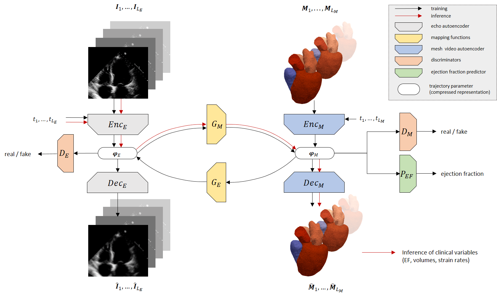

# Weakly supervised inference of personalized heart meshes based on echocardiography videos


This is the official repository of the paper [Weakly supervised inference of personalized heart meshes based on echocardiography videos](https://www.sciencedirect.com/science/article/pii/S136184152200281X)

## Requirements
This code is tested on Tensorflow 2.7. Requirements (including tensorflow) can be installed using:
```bash
pip install -r requirements.txt
```
Remark: psbody-mesh (MPI-IS/mesh) has to be installed separately.
Install mesh processing libraries from [MPI-IS/mesh](https://github.com/MPI-IS/mesh).

## Data
Download the publicly available echocardiography videos from https://echonet.github.io/dynamic/. 
(The data folder can be specified as argument when running the training script.)

## Running the code
The following python scripts need to be executed one after the other:

1) Train the echo autoencoder (EA) with:
```bash
python run_generative_heart_model.py source/configs/generative_model --mode=dhb_eae  --echo_dir=<path_to_echonet_data_folder>
```
The run is saved under the experiments/EAE/<YYYYMMDD-hhmmss>

2) Train the mesh video autoencoder (MVA) with:
```bash
python run_generative_heart_model.py source/configs/generative_model --mode=dhb_mae  --echo_dir=<path_to_echonet_data_folder>
```
The run is saved under the experiments/MAE/<YYYYMMDD-hhmmss>

Note that the training of the mesh video autoencoder takes up to two to three days. Only if the phase scatter plot located in the experiments/MAE/<YYYYMMDD-hhmmss>/plots/test/phases/ folder shows a nice correlation, one should continue with the next step.

3) (OPTIONAL) Train the echo EF predictor:

This run is to have a sanity check for the latent vectors of the echo autoencoder. The predicted EF (under plots) should have fairly good correlation with the ground-truth.

```bash
python run_generative_heart_model.py source/configs/generative_model --mode=echo_ef_pred  --echo_dir=<path_to_echonet_data_folder>
```
The run is saved under the experiments/ECHO_EF/<YYYYMMDD-hhmmss>


4) Train the mesh EF predictor:
```bash
python run_generative_heart_model.py source/configs/generative_model --mode=mesh_ef_pred --echo_dir=<path_to_echonet_data_folder>
```
The run is saved under the experiments/MESH_EF/<YYYYMMDD-hhmmss>

5) Train the cycle GAN:
```bash
python run_generative_heart_model.py source/configs/generative_model --mode=gm --echo_dir=<path_to_echonet_data_folder>
```
The run is saved under the experiments/GenModel/<YYYYMMDD-hhmmss>

Under "visualization" different reconstructed 4D heart shapes are generated.

Under "ef_data" one can find the ejection fraction (EF) correlation plots between doctor derived EF from the original echos and the derived EF from the predicted 4D meshes.

- EF_Biplane_scatter: Echo EF vs. EF from the predicted mesh calculated with biplane
- EF_Vol_scatter: Echo EF vs. EF from predicted mesh calculated from the volumes directly
- EF_Mesh_scatter:  EF from predicted mesh calculated with biplane vs. EF predictions from mesh latents
- EF_Pred_scatter: Echo EF vs. EF predictions from mesh latents

---
If this repository was helpful for your research please consider citing:

  @article{laumer2022weakly,
  title={Weakly supervised inference of personalized heart meshes based on echocardiography videos},
  author={Laumer, Fabian and Amrani, Mounir and Manduchi, Laura and Beuret, Ami and Rubi, Lena and Dubatovka, Alina and Matter, Christian M and Buhmann, Joachim M},
  journal={Medical Image Analysis},
  pages={102653},
  year={2022},
  publisher={Elsevier}
}
